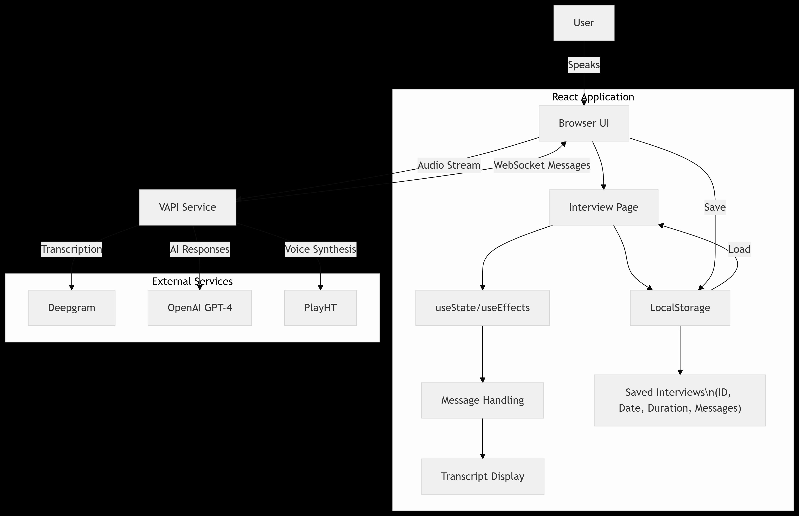

# 🎙️ Sona

> **Speak. Listen. Imagine.**  
> Your AI-powered voice companion for interviews, stories, and beyond.


---

**Sona** is a voice-first AI experience platform that simulates interactive conversations, from job interview practice to immersive storytelling. Whether you're prepping for your next big opportunity or exploring magical tales, Sona brings it to life through natural, real-time voice dialogue.

---

## ✨ Key Features

### 🧠 AI-Powered Conversations
- Mock interviews with GPT-4 Turbo
- Interactive storytelling (fantasy, sci-fi, comedy, more)
- Real-time voice and text interactions

### 🎤 Voice-first Experience
- Powered by Vapi.ai + Deepgram transcription
- Supports multiple voices and accents
- Adaptive responses and tone

### 📚 Conversation History
- Save and review past interviews or story sessions
- Track improvement over time
- Local-first storage (no server required)

---

## ⚙️ Tech Stack

| Layer         | Technology                                                                 |
|---------------|------------------------------------------------------------------------------|
| Frontend      | Next.js 14 (App Router), TypeScript, Tailwind CSS                           |
| Voice Engine  | [Vapi.ai](https://vapi.ai), Deepgram (Real-time speech transcription)        |
| NLP & AI      | OpenAI GPT-4 Turbo                                                           |
| Storage       | LocalStorage (client-side saved sessions)                                   |
| Hosting       | Vercel / CPanel                                                              |
| CI/CD         | GitHub Actions                                                               |

---

## 🔧 Setup & Installation

### Prerequisites
- Node.js v18+
- OpenAI API Key
- Vapi.ai API Key

### Clone & Install
```bash
git clone https://github.com/yourusername/sona.git
cd sona
npm install
```

### Configure Environment
```bash
# .env.local
VAPI_API_KEY="your_vapi_key"
OPENAI_API_KEY="your_openai_key"
```

### Run Locally
```bash
npm run dev
```

---

## 🗂 Project Structure

```
.
├── app/
│   ├── page.tsx           # Voice chat UI
├── components/              # UI elements (chat, sidebar, controls)
├── lib/
│   ├── vapi.ts              # Vapi client helper
│   ├── utils.ts             # Utility functions
├── public/                  # Static assets
├── styles/                  # TailwindCSS styles
└── types/                   # Shared TS types
```

---

## 🧭 Current Modes

| Mode         | Description                                           |
|--------------|-------------------------------------------------------|
| **Mock Interview** | AI simulates a job interview with real-time questions |
| **Story Mode**     | Sona asks what kind of story you want and begins the tale |
| *(More Coming Soon)* | Expand to coaching, training, and educational prompts |

---

## 🛣️ Roadmap

- [ ] Emotion detection through voice tone
- [ ] Fully customizable personas (e.g., Storyteller, Coach, Therapist)
- [ ] Story branches and memory
- [ ] Multi-language support
- [ ] Interactive Video with a robot interface that can recognise different things

---

## 🗂 System Diagram


---

## Prod Launch Architecture Diagram


---

## 🤝 Contributing

We welcome contributions! Here's how to get started:

1. Fork the repo
2. Create a new branch (`git checkout -b feature/amazing-idea`)
3. Make changes, commit (`git commit -m "✨ Add amazing idea"`)
4. Push to your branch (`git push origin feature/amazing-idea`)
5. Open a pull request

---

## 📜 License

MIT License. See [`LICENSE`](./LICENSE) for more.

---

## 🙋‍♂️ Author

**Nicanor Korir**  
[LinkedIn](https://linkedin.com/in/nicanorkorir)  
[Portfolio](https://nicanor.me)

---
