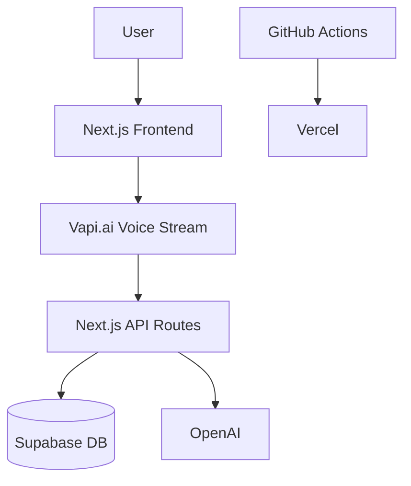

```markdown
# AI Job Interview Coach

[](https://opensource.org/licenses/MIT)
[](https://github.com/yourusername/ai-interview-coach/actions)
[](https://your-app.vercel.app)

A voice-powered AI mock interview platform that helps users practice job interviews with real-time feedback and personalized reports.

## ✨ Features

- **Realistic Mock Interviews**  
  - Industry-specific questions (Tech, Sales, Healthcare)
  - Dynamic follow-up questions based on responses
- **AI-Powered Analysis**  
  - Real-time speech metrics (filler words, pace, tone)
  - GPT-4 generated feedback reports
- **Flexible Authentication**  
  - Guest sessions (IP-based tracking)
  - Google/Email login (after 2 sessions)
- **Session History**  
  - Review past performance
  - Track improvement over time

## 🛠 Tech Stack

| Component          | Technology                                                                 |
|--------------------|---------------------------------------------------------------------------|
| Frontend           | Next.js 14 (App Router), TypeScript, Tailwind CSS                         |
| Voice AI           | [Vapi.ai](https://vapi.ai) (`@vapi-ai/web`)                              |
| Database           | Supabase PostgreSQL (with Prisma ORM)                                    |
| Authentication     | NextAuth.js (Google + Email/Password)                                    |
| AI                 | OpenAI GPT-4-turbo (Reports) + Vapi Speech Analytics                     |
| Hosting            | Vercel (Frontend + Serverless Functions)                                 |
| CI/CD              | GitHub Actions                                                           |

## 📊 Architecture



## 🚀 Getting Started

### Prerequisites
- Node.js v18+
- Supabase account
- Vapi.ai API key
- OpenAI API key

### Installation
1. Clone the repo:
   ```bash
   git clone https://github.com/yourusername/ai-interview-coach.git
   cd ai-interview-coach
   ```

2. Install dependencies:
   ```bash
   npm install
   ```

3. Set up environment variables:
   ```env
   # .env.local
   DATABASE_URL="postgresql://..."
   VAPI_API_KEY="your_vapi_key"
   OPENAI_API_KEY="your_openai_key"
   NEXTAUTH_SECRET="your_secret"
   ```

4. Initialize database:
   ```bash
   npx prisma migrate dev
   ```

### Running Locally
```bash
npm run dev
```

## 🌐 Deployment

1. Push to GitHub - triggers CI/CD pipeline:
   ```mermaid
   flowchart LR
     A[Git Push] --> B[Run Tests]
     B --> C{Pass?}
     C -->|Yes| D[Deploy to Vercel]
     C -->|No| E[Notify Team]
   ```

2. Vercel automatically deploys from `main` branch.

## 📂 Project Structure

```
.
├── app/
│   ├── (auth)/               # Auth pages
│   ├── interview/            # Voice interface
│   ├── dashboard/            # User history
│   └── api/                  # API routes
├── lib/
│   ├── auth.ts               # NextAuth config
│   ├── vapi.ts               # Voice client
│   └── db.ts                 # Prisma client
├── prisma/                   # DB schema
├── public/                   # Static assets
└── styles/                   # Tailwind CSS
```

## 📈 Roadmap

- [ ] Multi-language support
- [ ] Custom interview templates
- [ ] Emotion detection
- [ ] Mobile app (React Native)

## 🤝 Contributing

1. Fork the project
2. Clone the forked repo and Create your feature branch (`git checkout -b feature/AmazingFeature`)
3. Commit your changes (`git commit -m 'Add some AmazingFeature'`)
4. Push to the branch (`git push origin feature/AmazingFeature`)
5. Open a Pull Request

## 📜 License

Distributed under the MIT License. See `LICENSE` for more information.

## 📧 Author

Nicanor Korir
```
